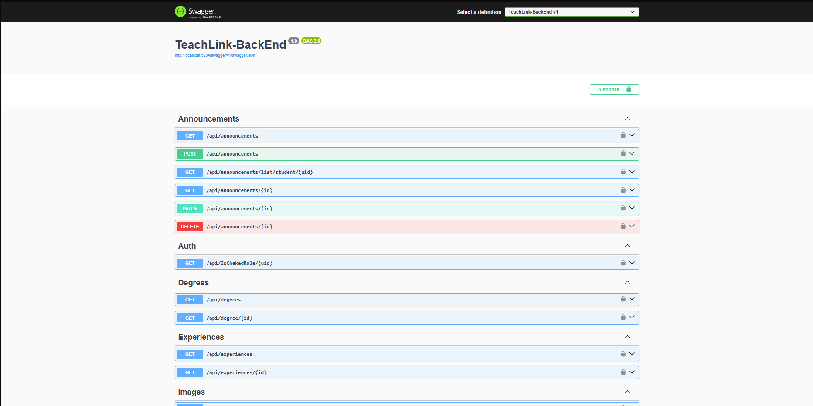

<table>
  <tr>
    <td width='1200px' height='120px'>
      

        
      

    </td>
  </tr>

  <tr>
    <td>
      

        
        
        
      
  
    </td>
  </tr>
</table>

<table>
  <tr>
    <td colspan="2">
  
  ##  Description:
  </td>
  </tr>

  <tr>
  <td colspan ="2">

> _**This repository contains the backend API for TeachLink — an international platform that connects tutors and students. It provides RESTful endpoints for managing users, profiles, announcements, reviews, and more.**_

  </td>
  </tr>
   
</table>

<table>
<tr>
  <td colspan="2">
<h2>Swager UI:</h2>
</td>
</tr>
  <tr>
    <td>
      

    </td>
</table>

